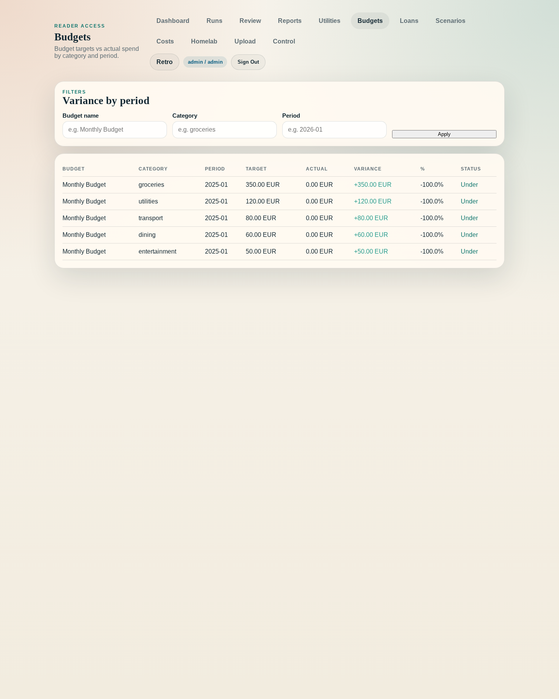
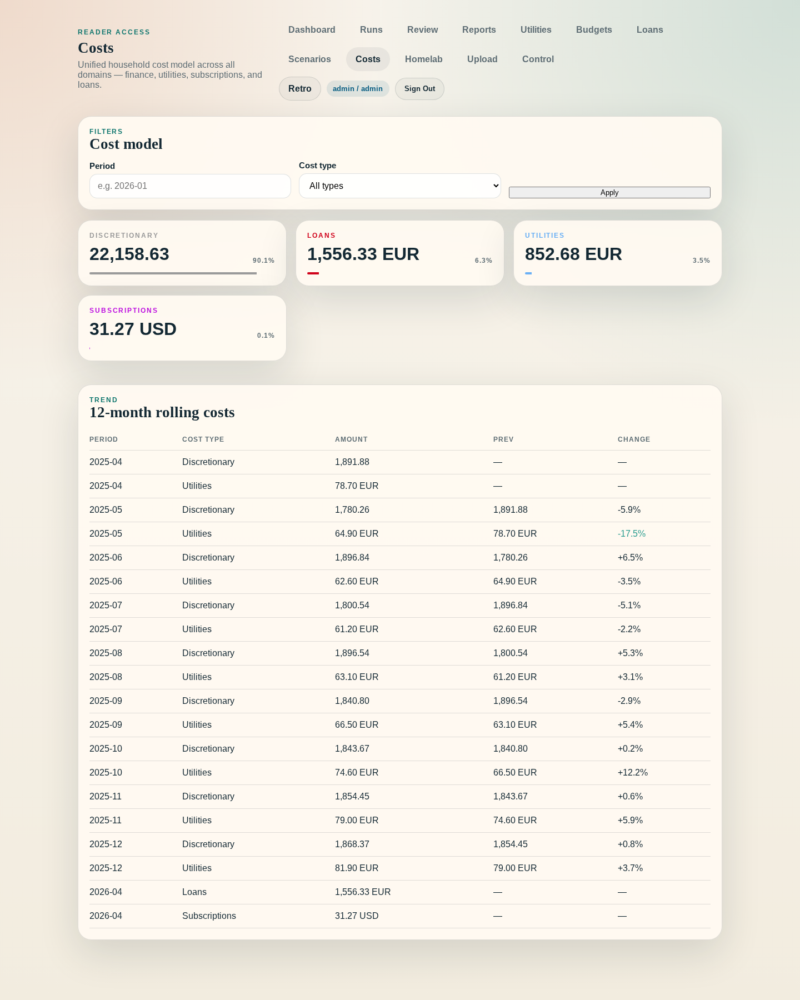
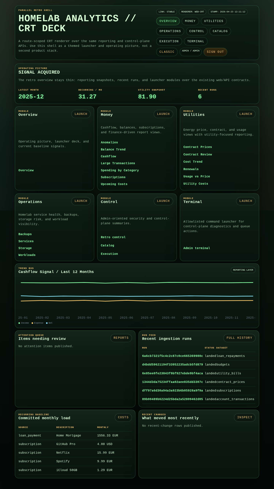

# homelab-analytics

Self-hosted household operating platform for ingesting heterogeneous personal datasets, normalizing them into reusable canonical models, and publishing household operating views through `/reports`, APIs, and automation surfaces.

The platform answers recurring household questions about money, utilities, and infrastructure operations through a composable Household Operating Picture built on explicit bronze/silver/gold data boundaries, canonical facts and dimensions, and stable publication contracts.

**Get started:** `make first-run` — builds images, starts services, seeds demo data, and prints the onboarding URL.

This is not a Home Assistant add-on. Home Assistant is a first-class integration partner: it is the edge runtime, device hub, family-facing operational UI, and primary actuation surface. This platform provides what a HA add-on cannot — canonical cross-domain household semantics spanning finance, utilities, assets, contracts, loans, and homelab telemetry; long-horizon history; planning, simulation, and policy evaluation logic; trust and lineage; and multi-surface publishing. Platform outputs flow back to HA as synthetic entities for visualization, voice responses, and automation triggers. See `docs/product/homeassistant-and-smart-home-hub.md` for the product boundary and `docs/architecture/homeassistant-integration-hub.md` for the integration architecture.

Database support model: Postgres is the canonical operational database for control-plane state, landing metadata, and published reporting. SQLite remains a local bootstrap fallback. DuckDB remains the worker/local analytical warehouse engine and is not the application's primary shared-production read contract.

Architecture posture: keep one repo and one deployment story. The codebase is being hardened around four internal stability strata: kernel, semantic engine, product packs, and surfaces. The useful boundary is change rate and conceptual ownership, not API vs worker vs web as separate service products.

## Example outcomes

The demo bundle now produces publish-backed product surfaces that show the intended operator outcomes:

<table>
  <tr>
    <td></td>
    <td></td>
    <td></td>
  </tr>
  <tr>
    <td>Budget progress</td>
    <td>Cost model</td>
    <td>Retro operating deck</td>
  </tr>
</table>

## Product direction

The project follows an 11-stage roadmap from analytics platform to household operating platform:

0. Documentation reset and direction lock
1. Canonical household model
2. Operating views
3. Planning and control surfaces
4. Simulation and scenario engine
5. Policy, automation, and action engine
6. Integration adapter layer
7. Multi-renderer and semantic delivery layer
8. Extension and pack ecosystem
9. Trust, governance, and operator confidence
10. Agentic and assistant layer

Stage 2 is complete. Stage 3 is partially complete. Stage 4 is partially complete with five shipped scenario types. Stage 5 is substantially complete through the Home Assistant bridge, policy evaluation, synthetic entity publication, approval-aware action dispatch, and operator approval controls. See `docs/plans/household-operating-platform-roadmap.md` for stage details and `docs/decisions/household-operating-platform-direction.md` for the direction ADR.

## Current capabilities

- Four built-in capability packs: finance, utilities, homelab, and cross-domain overview
- Stable publication-backed operating views across cashflow, planning, utility, homelab, and overview questions
- Stable monthly finance read surface at `/reports` for monthly cashflow, budget variance, loan overview, and expense-shock follow-through
- Full data pipeline: landing (bronze) → transformation (silver) → reporting (gold)
- Budget vs Reality: per-category budget targets against actual spend with variance and utilisation tracking
- Debt and Cost Truth: amortization engine, loan schedule projection, repayment variance, and balance estimates
- Household Cost Model: unified cost picture aggregated from all domains with 12-month trend
- Affordability Ratios: housing-to-income, total-cost-to-income, and debt-service ratio with threshold assessments
- Recurring Cost Baseline: active subscriptions, loan payments, and detected utility fixed charges
- Config-driven source onboarding for CSV, XLSX, JSON, and HTTP sources
- SCD Type 2 dimensions with current-dimension reporting views
- Authentication: OIDC-first external identity, app-local authorization, scoped service tokens, and narrow local break-glass fallback
- FastAPI-based REST API with Prometheus metrics and structured JSON logging
- Next.js web shell with `/reports`, budgets, loans, costs, upload, and control-plane admin
- Source freshness and remediation surfaces: `/sources` and `/runs` expose staleness, retry, and quick-action upload links
- Worker CLI with schedule dispatch, lease renewal, and stale-dispatch recovery
- Docker Compose and Helm/Kubernetes deployment paths
- Extension model for external connectors, transformations, and marts
- Home Assistant integration: WebSocket and API ingest, MQTT synthetic entity publication, policy evaluation, approval-aware action dispatch, and operator approval controls
- Simulation engine: loan what-if, income change, expense shock, utility tariff shock, and homelab cost/benefit scenarios with assumption tracking and staleness detection
- Immutable evidence model: content-addressed batch ingest, append-only transaction observations, reconciled entity projections
- Large pytest suite covering architecture contracts, domain logic, API behavior, storage adapters, and integration paths

## Repository layout

```text
homelab-analytics/
├── apps/
│   ├── api/                    # FastAPI application
│   ├── worker/                 # Worker CLI and dispatch
│   └── web/                    # Next.js web shell
├── packages/
│   ├── adapters/               # API and worker adapter layer
│   ├── analytics/              # Reporting logic
│   ├── application/            # Use-case orchestration
│   ├── connectors/             # External connectors
│   ├── domains/                # Domain capability packs
│   │   ├── finance/            # Cash flow, subscriptions, transactions
│   │   ├── utilities/          # Utility costs, contracts, metering
│   │   ├── overview/           # Cross-domain composition
│   │   └── homelab/            # HA integration, homelab telemetry
│   ├── pipelines/              # Transformation and mart logic; remaining engine/domain seam still being reduced
│   ├── platform/               # Runtime, auth, capability types
│   ├── shared/                 # Extension registry, auth shim, contracts
│   └── storage/                # Postgres control-plane/reporting, DuckDB warehouse, SQLite local fallback, S3 adapters
├── charts/
│   └── homelab-analytics/      # Helm chart
├── infra/
│   ├── docker/                 # Dockerfiles
│   └── examples/               # Compose, secrets examples
├── docs/
│   ├── architecture/           # Data platform architecture
│   ├── agents/                 # Agent mode guidance
│   ├── decisions/              # ADRs
│   ├── plans/                  # Strategic plans and roadmap
│   ├── product/                # Product scope and design
│   ├── sprints/                # Sprint plans and scope
│   ├── runbooks/               # Operational guides
│   └── notes/                  # Integration notes
├── requirements/               # Requirements baseline
└── tests/                      # Pytest suite and architecture tests
```

## Documentation

- `docs/README.md` — full documentation index
- `requirements/README.md` — requirements baseline across five domains
- `docs/architecture/data-platform-architecture.md` — source-to-reporting data architecture and forward-looking layer definitions
- `docs/architecture/contract-governance.md` — contract compatibility policy, stale-artifact checks, and release bundle workflow
- `docs/architecture/publication-contracts.md` — publication and UI descriptor contract model for renderer consumers
- `docs/runbooks/release-governance.md` — branch lifetime, tag policy, GitHub Release policy, and minimum release checklist
- `docs/decisions/household-operating-platform-direction.md` — operating platform direction and 11-stage model
- `docs/decisions/household-platform-adr-and-refactor-blueprint.md` — modular monolith architecture and capability pack model
- `docs/decisions/operational-database-support-model.md` — canonical operational database support model and database-role separation
- `docs/product/core-household-operating-picture.md` — core product definition and acceptance criteria
- `docs/plans/household-operating-platform-roadmap.md` — 11-stage roadmap with deliverables and dependencies
- `docs/product/homeassistant-and-smart-home-hub.md` — Home Assistant as edge runtime and actuation layer, platform vs HA boundary, and build ordering
- `docs/architecture/homeassistant-integration-hub.md` — six-layer HA integration hub architecture

## Run locally

The API uses FastAPI, the worker is a lightweight Python entrypoint, and the web workload is a Next.js frontend with a thin Python launcher.

The repository intentionally supports three blessed startup stories:

- Local demo/dev: `.env.example`, `make demo-generate`, and `make demo-seed`; SQLite control plane, DuckDB warehouse, disabled identity, and filesystem blob storage.
- Single-user homelab: `infra/examples/compose.yaml` with `infra/examples/secrets/auth-local.env.example`; Postgres control plane/reporting, MinIO-backed blob storage, and `local_single_user` break-glass auth.
- Shared OIDC deployment: `charts/homelab-analytics/values.oidc-ingress-example.yaml` with `infra/examples/secrets/oidc-secret.example.yaml`; Postgres control plane/reporting, S3-compatible blob storage, and `oidc` identity.

Key environment variables (see `docs/runbooks/configuration.md` for the full reference):

- `HOMELAB_ANALYTICS_DATA_DIR` — local data directory (default: `.local/homelab-analytics`)
- `HOMELAB_ANALYTICS_CONTROL_PLANE_BACKEND` — control-plane backend selector (`postgres` for shared deployments, `sqlite` only for local bootstrap fallback)
- `HOMELAB_ANALYTICS_REPORTING_BACKEND` — reporting read path selector; `duckdb` for worker/local warehouse reads, `postgres` for published app-facing relations
- `HOMELAB_ANALYTICS_POSTGRES_DSN` — shared Postgres backend DSN
- `HOMELAB_ANALYTICS_CONTROL_PLANE_DSN` — control-plane Postgres DSN override
- deprecated compatibility aliases: `HOMELAB_ANALYTICS_CONFIG_BACKEND`, `HOMELAB_ANALYTICS_METADATA_BACKEND`, `HOMELAB_ANALYTICS_CONTROL_POSTGRES_DSN`, `HOMELAB_ANALYTICS_METADATA_POSTGRES_DSN`
  - aliases emit runtime `DeprecationWarning`; removal is planned no earlier than `v0.2.0`
- `HOMELAB_ANALYTICS_IDENTITY_MODE` — canonical identity mode selector: `disabled`, `local`, `local_single_user`, `oidc`, or `proxy`
- `HOMELAB_ANALYTICS_AUTH_MODE` — legacy compatibility fallback when `HOMELAB_ANALYTICS_IDENTITY_MODE` is unset; warning window: `v0.1.x`; strict-gate window: `v0.2.x`; removal target: no earlier than `v0.3.0`; migration strict guard: `HOMELAB_ANALYTICS_AUTH_MODE_LEGACY_STRICT=true`
- optional upstream machine JWT path: set `HOMELAB_ANALYTICS_MACHINE_JWT_ENABLED=true` with issuer/audience config to accept non-interactive bearer principals through the same in-app authorization model used by service tokens
- `HOMELAB_ANALYTICS_BLOB_BACKEND` — `filesystem` or `s3` (default: `filesystem`)
- `HOMELAB_ANALYTICS_EXTENSION_PATHS` — custom import roots for external extensions

Examples:

```bash
python -m apps.worker.main ingest-account-transactions tests/fixtures/account_transactions_valid.csv
python -m apps.worker.main generate-demo-data --output-dir infra/examples/demo-data
python -m apps.worker.main seed-demo-data --input-dir infra/examples/demo-data
python -m apps.worker.main list-runs
python -m apps.worker.main report-monthly-cashflow
python -m apps.worker.main watch-schedule-dispatches
python -m apps.api.main
python -m apps.web.main
```

When a DuckDB transformation service is configured, built-in datasets auto-promote successful runs into the current silver/gold path through source-asset transformation bindings and publication definitions. Re-running promotion for the same run is idempotent and refreshes marts without duplicating facts.

## Demo data

The repository now ships a public synthetic demo bundle under `infra/examples/demo-data/`.
It contains:

- source-shaped finance exports under `infra/examples/demo-data/sources/` for OP-style personal/common account CSVs, a Revolut CSV, credit-card statement PDFs plus JSON sidecars, and loan-registry HTML/TXT snapshots
- canonical seed datasets under `infra/examples/demo-data/canonical/` for account transactions, subscriptions, contract prices, utility bills, budgets, and loan repayments
- a `manifest.json` that records the bundle contents, intended dataset names, and whether each artifact is supported now or template-only

`.samples/` remains local-only reference material and is gitignored. The demo generator does not read from `.samples/` at runtime.

Generate or refresh the bundle locally:

```bash
make demo-generate
```

Seed a local instance:

```bash
make demo-seed
```

Seed the example Compose stack:

```bash
docker compose -f infra/examples/compose.yaml up -d api web
docker compose -f infra/examples/compose.yaml --profile worker run --rm \
  -v "$(pwd)/infra/examples/demo-data:/demo-data:ro" \
  worker seed-demo-data --input-dir /demo-data
```

The seed command creates or updates stable demo source bindings for the source-shaped account exports, ingests the supported demo datasets through the existing landing and promotion services, and prints a JSON summary with config status, run IDs, and reporting counts.

## Verification

```bash
make verify-fast
make verify-config
make test-e2e-local
make verify-domain DOMAIN=account
make verify-domain DOMAIN=subscriptions
make verify-domain DOMAIN=contract_prices
make verify-domain DOMAIN=utility
make test-storage-adapters
make compose-smoke
```

Use `make verify-config VERIFY_CONFIG_ARGS="--source-asset-id <source_asset_id>"` to preflight a single config-driven slice before running ingestion or promotion. The account, subscriptions, contract-prices, and utility `verify-domain` harnesses now run both global and scoped preflight checks before processing ingestion definitions.

## Extension model

The application keeps core ingestion, transformation, and reporting logic in-repo, but also supports external extension modules.

- Built-in features are registered in a shared layer registry
- External repositories or mounted custom paths can be added with `HOMELAB_ANALYTICS_EXTENSION_PATHS`
- Extension modules are imported from `HOMELAB_ANALYTICS_EXTENSION_MODULES`
- Each extension module must define `register_extensions(registry)` and register entries for `landing`, `transformation`, `reporting`, or `application`
- Executable extensions can be invoked through the worker CLI and API
- Published reporting extensions can declare `publication_relations` for Postgres mirroring

See `docs/architecture/data-platform-architecture.md` for the full extensibility model, pack ecosystem model, and registry source expectations.

## Install locally

```bash
python -m pip install -e .
homelab-analytics-worker list-runs
homelab-analytics-api
# build apps/web/frontend first, or use the Docker web image below
homelab-analytics-web
```

## Run with Docker

```bash
docker build -f infra/docker/Dockerfile -t homelab-analytics .
docker build -f infra/docker/web.Dockerfile -t homelab-analytics-web .
docker run --rm -p 8080:8080 -v "$(pwd)/.local/homelab-analytics:/data" homelab-analytics

make compose-smoke
docker compose -f infra/examples/compose.yaml up --build
```

The example Compose stack includes Postgres and MinIO and configures workloads for control-plane state, published reporting, landed payload storage, and local break-glass auth. `make compose-smoke` is the operator-facing startup check.

## Run with Helm

```bash
helm lint charts/homelab-analytics
helm template homelab-analytics charts/homelab-analytics
helm install homelab-analytics charts/homelab-analytics
```

The default chart values enable OIDC auth. See `docs/runbooks/operations.md` for ingress, readiness, and alert-response guidance. See `charts/homelab-analytics/values.runtime-secrets-example.yaml` for the intended Secret isolation split.
